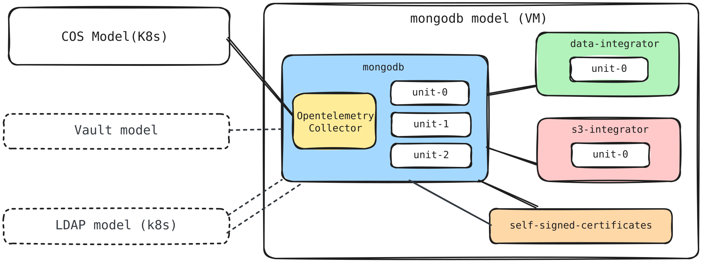

# Terraform module for MongoDB replica set

This Terraform root module facilitates the deployment of a Charmed MongoDB
replica set on AWS VMs using the
[Terraform Juju provider](https://github.com/juju/terraform-provider-juju/).
For more information, refer to the provider
[documentation](https://registry.terraform.io/providers/juju/juju/latest/docs).

The solution deploys MongoDB with a data integrator, TLS certificates,
OpenTelemetry Collector, and COS Lite. It can also integrate with existing LDAP
and Vault deployments and an optional S3 integrator for backups.

## Requirements

| Name          | Version       |
| ------------- | ------------- |
| Terraform     | >= 1.6        |
| Juju provider | >= 2.1, < 3.0 |
| Juju          | 3.6 or later  |

An AWS cloud and credential must be configured in Juju. A Kubernetes cloud and
credential named `k8s` are used for COS Lite by default and can be overridden
through `var.cos`.

The Juju provider can be configured with `JUJU_CONTROLLER_ADDRESSES`,
`JUJU_USERNAME`, and `JUJU_PASSWORD`.

## Providers

| Name   | Version       |
| ------ | ------------- |
| `juju` | >= 2.1, < 3.0 |

## Modules

| Name                       | Source                                                                    |
| -------------------------- | ------------------------------------------------------------------------- |
| `mongodb_replica_set`      | `canonical/mongodb-operator//terraform/product/replica_set` (`8/edge`)    |
| `cos`                      | `canonical/observability-stack//terraform/cos-lite` (`tf-cos-lite-3.0.2`) |
| `self_signed_certificates` | `canonical/self-signed-certificates-operator//terraform` (`main`)         |

## Resources

| Name                                                  | Type                                                                                                    |
| ----------------------------------------------------- | ------------------------------------------------------------------------------------------------------- |
| `juju_model.mongodb`                                  | [Juju model](https://registry.terraform.io/providers/juju/juju/latest/docs/resources/model)             |
| `juju_space.peers`                                    | [Juju space](https://registry.terraform.io/providers/juju/juju/latest/docs/resources/space) for MongoDB replica-set traffic                                                               |
| `juju_subnet.peers`                                   | [Juju subnet](https://registry.terraform.io/providers/juju/juju/latest/docs/resources/subnet): Assignment of the AWS peer subnet to the `peers` space                                                   |
| `juju_application.opentelemetry_collector`            | [Juju application](https://registry.terraform.io/providers/juju/juju/latest/docs/resources/application) |
| `juju_integration.opentelemetry_collector_prometheus` | [Juju integration](https://registry.terraform.io/providers/juju/juju/latest/docs/resources/integration) |
| `juju_integration.opentelemetry_collector_loki`       | [Juju integration](https://registry.terraform.io/providers/juju/juju/latest/docs/resources/integration) |
| `juju_integration.opentelemetry_collector_dashboards` | [Juju integration](https://registry.terraform.io/providers/juju/juju/latest/docs/resources/integration) |

## Inputs

| Name                                    | Description                                                                                                                                                                                       | Type                                                                                                                                                                                                                                                                                                                                                                                                                                                                                                                                                                                                                                                                                                                                                                                                       | Default         | Required   |
| --------------------------------------- | --------------------------------------------------------------------------------------------------------------------------------------------------------------------------------------------------------------------------------------------------------------------------------------------------------------------------------------------------------------------------------------------------------------------------------------------------------------------------------------------------------------------------------------------------------------------------------------------------------------------------------------------------------------------------------------------------------------------------------------------------------------------------------------------------------- | ---------------------------------------------------------------------------------------------------------------------------------------------------------------------------------------------------------------------------------------------------------------------------------------------------------------------------------------------------------------------------------------------------------------------------------------------------------------------------------------------------------------------------------------------------------------------------------------------------------------------------------------------------------------------------------------------------------------------------------------------------------------------------------------------------------- | --------------- | :--------: |
| `mongodb_model`                         | Name of the AWS VM model                                                                                                                                                                          | `string`                                                                                                                                                                                                                                                                                                                                                                                                                                                                                                                                                                                                                                                                                                                                                                                                   | `"mongodb"`     | no         |
| `vpc_id`                                | AWS VPC ID for the MongoDB model. Required with this repository's `clouds/aws` module; otherwise optional                                                                                          | `string`                                                                                                                                                                                                                                                                                                                                                                                                                                                                                                                                                                                                                                                                                                                                                                                                   | `null`          | no         |
| `network_spaces`                        | CIDR of the existing AWS subnet assigned to the MongoDB peer Juju space                                                                                                                           | <pre>object({<br/>  peers_cidr = optional(string, "10.0.2.0/24")<br/>})</pre>                                                                                                                                                                                                                                                                                                                                                                                                                                                                                                                                                                                                                                                                          | `{}`            | no         |
| `cos`                                   | COS model, cloud, credential, and channel risk configuration                                                                                                                                      | <pre>object({<br/>  model      = optional(string, "cos")<br/>  cloud      = optional(string, "k8s")<br/>  credential = optional(string, "k8s")<br/>  risk       = optional(string, "stable")<br/>})</pre>                                                                                                                                                                                                                                                                                                                                                                                                                                                                                                                                                                                                  | `{}`            | no         |
| `mongodb`                               | MongoDB replica-set application configuration                                                                                                                                                     | <pre>object({<br/>  app_name           = optional(string, "mongodb")<br/>  base               = optional(string, "ubuntu@24.04")<br/>  channel            = optional(string, "8/stable")<br/>  config             = optional(map(string), { role = "replication" })<br/>  constraints        = optional(string, "arch=amd64 spaces=peers")<br/>  endpoint_bindings  = optional(set(object({ space = string, endpoint = optional(string) })), [{ endpoint = "database-peers", space = "peers" }])<br/>  expose             = optional(list(object({ cidrs = optional(string), endpoints = optional(string), spaces = optional(string) })), [])<br/>  machines           = optional(set(string), null)<br/>  revision           = optional(number, null)<br/>  storage_directives = optional(map(string), {})<br/>  units              = optional(number, 3)<br/>})</pre> | `{}`            | no         |
| `data_integrator`                       | Data-integrator application configuration                                                                                                                                                         | <pre>object({<br/>  app_name           = optional(string, "data-integrator")<br/>  base               = optional(string, "ubuntu@24.04")<br/>  channel            = optional(string, "latest/stable")<br/>  config             = optional(map(string), { database-name = "mongodb", extra-user-roles = "admin" })<br/>  constraints        = optional(string, "arch=amd64")<br/>  endpoint_bindings  = optional(set(object({ space = string, endpoint = optional(string) })), [])<br/>  machines           = optional(set(string), null)<br/>  revision           = optional(number, null)<br/>  storage_directives = optional(map(string), {})<br/>  units              = optional(number, 1)<br/>})</pre>                                                                                                | `{}`            | no         |
| `s3_integrator`                         | Optional S3 backup-integrator configuration                                                                                                                                                       | <pre>object({<br/>  config      = map(string)<br/>  channel     = optional(string, "2/stable")<br/>  base        = optional(string, "ubuntu@24.04")<br/>  revision    = optional(number, null)<br/>  constraints = optional(string, "arch=amd64")<br/>  machines    = optional(set(string), [])<br/>})</pre>                                                                                                                                                                                                                                                                                                                                                                                                                                                                                               | `null`          | no         |
| `s3_access_key`                         | Optional AWS S3 access key                                                                                                                                                                        | `string` (sensitive)                                                                                                                                                                                                                                                                                                                                                                                                                                                                                                                                                                                                                                                                                                                                                                                       | `null`          | no         |
| `s3_secret_key`                         | Optional AWS S3 secret key                                                                                                                                                                        | `string` (sensitive)                                                                                                                                                                                                                                                                                                                                                                                                                                                                                                                                                                                                                                                                                                                                                                                       | `null`          | no         |
| `tls_client_private_key`                | Optional PEM private key for MongoDB client-to-server TLS                                                                                                                                         | `string` (sensitive)                                                                                                                                                                                                                                                                                                                                                                                                                                                                                                                                                                                                                                                                                                                                                                                       | `null`          | no         |
| `tls_peer_private_key`                  | Optional PEM private key for MongoDB peer-to-peer TLS                                                                                                                                             | `string` (sensitive)                                                                                                                                                                                                                                                                                                                                                                                                                                                                                                                                                                                                                                                                                                                                                                                       | `null`          | no         |
| `logging_config`                        | Logging configuration used by the MongoDB replica-set module                                                                                                                                     | `string`                                                                                                                                                                                                                                                                                                                                                                                                                                                                                                                                                                                                                                                                                                                                                                                                   | `"<root>=INFO"` | no         |
| `self_signed_certificates`              | Self-signed-certificates application configuration                                                                                                                                                | <pre>object({<br/>  app_name    = optional(string, "self-signed-certificates")<br/>  channel     = optional(string, "1/stable")<br/>  revision    = optional(number, null)<br/>  base        = optional(string, "ubuntu@24.04")<br/>  constraints = optional(string, "arch=amd64")<br/>  config      = optional(map(string), { ca-common-name = "MongoDB CA" })<br/>  units       = optional(number, 1)<br/>})</pre>                                                                                                                                                                                                                                                                                                                                                                                       | `{}`            | no         |
| `opentelemetry_collector`               | OpenTelemetry Collector subordinate application configuration                                                                                                                                     | <pre>object({<br/>  app_name = optional(string, "opentelemetry-collector")<br/>  channel  = optional(string, "2/stable")<br/>  revision = optional(number, null)<br/>  base     = optional(string, "ubuntu@24.04")<br/>  config   = optional(map(string), {})<br/>})</pre>                                                                                                                                                                                                                                                                                                                                                                                                                                                                                                                                 | `{}`            | no         |
| `ldap_integration`                      | Optional existing LDAP offer; must be configured with `ldap_certificate_transfer_integration`                                                                                                    | `object({ url = string })`                                                                                                                                                                                                                                                                                                                                                                                                                                                                                                                                                                                                                                                                                                                                                                                 | `null`          | no         |
| `ldap_certificate_transfer_integration` | Optional existing LDAP certificate-transfer offer; must be configured with `ldap_integration`                                                                                                    | `object({ url = string })`                                                                                                                                                                                                                                                                                                                                                                                                                                                                                                                                                                                                                                                                                                                                                                                 | `null`          | no         |
| `vault_kv_integration`                  | Optional existing Vault KV offer for encryption at rest                                                                                                                                           | `object({ url = string })`                                                                                                                                                                                                                                                                                                                                                                                                                                                                                                                                                                                                                                                                                                                                                                                 | `null`          | no         |

## Outputs

| Name         | Description                                                              |
| ------------ | ------------------------------------------------------------------------ |
| `components` | Map of all components deployed by the solution                           |
| `metadata`   | Metadata of the MongoDB replica-set deployment                           |
| `models`     | Map keyed by model UUID containing the components deployed in each model |
| `offers`     | Map of offers exposed by the MongoDB replica-set module                  |

## Optional integrations

### LDAP

The module does not deploy LDAP. To integrate an LDAP deployment from another
model, provide both its `ldap` and `ldap-certificate-transfer` offer URLs:

```hcl
ldap_integration = {
  url = "admin/ldap.ldap"
}

ldap_certificate_transfer_integration = {
  url = "admin/ldap.send-ca-cert"
}
```

Both integrations must be configured together and must refer to an existing,
operational LDAP deployment.

### Encryption at rest

Enable encryption in the MongoDB configuration and provide the Vault KV offer:

```hcl
mongodb = {
  config = {
    role                        = "replication"
    enable-encryption-at-rest   = "true"
  }
}

vault_kv_integration = {
  url = "admin/vault.vault-kv"
}
```

The module does not initialize, unseal, authorize, or configure Vault.

The offer must refer to an existing operational Vault deployment.
Follow the
[`vault` charm documentation](https://charmhub.io/vault/docs/h-initialize-vault)
to prepare it before applying this module.

### S3 backups

The S3 bucket must exist before deploying this solution. The AWS identity used
by the backup integrator must be able to list the bucket and read, create, and
delete objects under the configured path.

Add the backup integrator configuration to `terraform.tfvars`:

```hcl
s3_integrator = {
  config = {
    bucket   = "my-mongodb-backups"
    region   = "eu-west-3"
    endpoint = "https://s3.eu-west-3.amazonaws.com"
    path     = "mongodb"
  }
}
```

The configuration fields are:

- `bucket`: name of the existing S3 bucket.
- `region`: AWS region containing the bucket.
- `endpoint`: S3 API endpoint for the selected region.
- `path`: optional prefix under which MongoDB backups are stored.

Provide the S3 credentials through sensitive Terraform environment variables
instead of writing them to `terraform.tfvars`:

```bash
export TF_VAR_s3_access_key="<s3-access-key>"
export TF_VAR_s3_secret_key="<s3-secret-key>"
```

### TLS certificates

The solution deploys `self-signed-certificates` as its default certificate
authority. This is intended for evaluation, use your organization's certificate
provider for production deployments.

Optional custom MongoDB client and peer TLS private keys can be supplied through
the sensitive `tls_client_private_key` and `tls_peer_private_key` variables.

## Deploy

The following diagram shows the components deployed by this solution and their
integrations across the AWS VM and Kubernetes models.



Initialize Terraform:

```bash
terraform init
```

Retrieve the controller's VPC ID and expose it to Terraform:

```bash
export TF_VAR_vpc_id="$(juju model-config -m aws:controller vpc-id)"
```

Replace `aws` with your controller name if it differs.

Deploy the solution in two steps. First, create the MongoDB model:

```bash
terraform plan \
  -target=juju_model.mongodb \
  -out mongodb-model.out
terraform apply mongodb-model.out
```

### Configure Juju spaces

When the AWS infrastructure is deployed with the [`clouds/aws`](../../../../../../clouds/aws)
module, the VPC contains two private deployment subnets:

| AWS subnet                         | CIDR          | Intended traffic       |
| ---------------------------------- | ------------- | ---------------------- |
| `deployments_peers_subnet`         | `10.0.2.0/24` | MongoDB replica peers  |
| `deployments_clients_subnet`       | `10.0.3.0/24` | MongoDB client traffic |

Juju EC2 machines support only one network interface. This deployment places
MongoDB on `deployments_peers_subnet` and binds its peer endpoint to it.

The MongoDB module depends on the subnet assignment, ensuring that the space
is configured before Juju deploys MongoDB. After applying, inspect the result
with:

```bash
juju subnets -m mongodb
juju spaces -m mongodb
```

By default, the module places each MongoDB VM in the `peers` space and binds
the peer endpoint to it:

```hcl
mongodb = {
  constraints = "arch=amd64 spaces=peers"

  endpoint_bindings = [
    {
      endpoint = "database-peers"
      space    = "peers"
    },
  ]
}
```

The `spaces` constraint places the machine on the peer subnet. When overriding
`mongodb.constraints`, retain `spaces=peers` along with any additional
placement requirements.

The Juju space name `peers` is fixed by this reference architecture. Override
the existing AWS peer subnet CIDR through `network_spaces`:

```hcl
network_spaces = {
  peers_cidr = "10.20.2.0/24"
}
```

Then plan and apply the rest of the solution:

```bash
terraform plan \
  -out terraform.out
terraform apply terraform.out
```

Verify that the peer endpoint resolves to the peer subnet:

```bash
juju exec -m mongodb --unit mongodb/0 -- \
  network-get database-peers --bind-address
```

The address should be in `10.0.2.0/24`.
