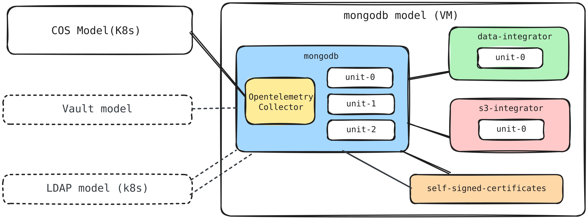

# Terraform module for mongodb-operator

This Terraform root module facilitates the deployment of a Charmed MongoDB
replica set on Azure VMs using the
[Terraform Juju provider](https://github.com/juju/terraform-provider-juju/).
For more information, refer to the provider
[documentation](https://registry.terraform.io/providers/juju/juju/latest/docs).

The solution deploys MongoDB with a data integrator, TLS certificates,
OpenTelemetry Collector, and COS Lite. It can also integrate with existing LDAP
and Vault deployments and an optional S3 integrator for backups.

## Requirements

| Name          | Version      |
| ------------- | ------------ |
| Terraform     | >= 1.6       |
| Juju provider | ~> 2.0       |
| Juju          | 3.6 or later |

An Azure cloud and credential must be configured in Juju. A Kubernetes cloud and
credential named `k8s` are used for COS Lite by default and can be overridden
through `var.cos`.

The Juju provider can be configured with `JUJU_CONTROLLER_ADDRESSES`,
`JUJU_USERNAME`, and `JUJU_PASSWORD`.

## Providers

| Name   | Version   |
| ------ | --------- |
| `juju` | ~> 2.0    |

## Modules

| Name                       | Source                                                                    |
| -------------------------- | ------------------------------------------------------------------------- |
| `mongodb_replica_set`      | `canonical/mongodb-operator//terraform/product/replica_set` (`8/edge`)    |
| `cos`                      | `canonical/observability-stack//terraform/cos-lite` (`tf-cos-lite-3.0.2`) |
| `self_signed_certificates` | `canonical/self-signed-certificates-operator//terraform` (`main`)         |

## Resources

| Name                                                  | Type                                                                                                    |
| ----------------------------------------------------- | ------------------------------------------------------------------------------------------------------- |
| `juju_model.mongodb`                                  | [Juju model](https://registry.terraform.io/providers/juju/juju/latest/docs/resources/model)             |
| `juju_application.opentelemetry_collector`            | [Juju application](https://registry.terraform.io/providers/juju/juju/latest/docs/resources/application) |
| `juju_integration.opentelemetry_collector_prometheus` | [Juju integration](https://registry.terraform.io/providers/juju/juju/latest/docs/resources/integration) |
| `juju_integration.opentelemetry_collector_loki`       | [Juju integration](https://registry.terraform.io/providers/juju/juju/latest/docs/resources/integration) |
| `juju_integration.opentelemetry_collector_dashboards` | [Juju integration](https://registry.terraform.io/providers/juju/juju/latest/docs/resources/integration) |

## Inputs

| Name                                    | Description                                                                                                                                                                                       | Type                                                                                                                                                                                                                                                                                                                                                                                                                                                                                                                                                                                                                                                                                                                                                                                                       | Default         | Required   |
| --------------------------------------- | --------------------------------------------------------------------------------------------------------------------------------------------------------------------------------------------------------------------------------------------------------------------------------------------------------------------------------------------------------------------------------------------------------------------------------------------------------------------------------------------------------------------------------------------------------------------------------------------------------------------------------------------------------------------------------------------------------------------------------------------------------------------------------------------------------- | ---------------------------------------------------------------------------------------------------------------------------------------------------------------------------------------------------------------------------------------------------------------------------------------------------------------------------------------------------------------------------------------------------------------------------------------------------------------------------------------------------------------------------------------------------------------------------------------------------------------------------------------------------------------------------------------------------------------------------------------------------------------------------------------------------------- | --------------- | :--------: |
| `mongodb_model`                         | Name of the azure VM model                                                                                                                                                                          | `string`                                                                                                                                                                                                                                                                                                                                                                                                                                                                                                                                                                                                                                                                                                                                                                                                   | `"mongodb"`     | no         |
| `remote-state`                          | Configuration for remote state to reference Azure infrastructure created by the clouds/azure module                                                                                                 | <pre>object({<br/>  resource_group_name  = optional(string, "tfstate-rg")<br/>  storage_account_name = string<br/>  container_name       = optional(string, "tfstate")<br/>  key                  = optional(string, "infra.terraform.tfstate")<br/>})</pre>                                                                                                                                                                                                                                                                                                                                                                                                                                                                                                                                         | `null`          | no         |
| `cos`                                   | COS model, cloud, credential, and channel risk configuration                                                                                                                                      | <pre>object({<br/>  model      = optional(string, "cos")<br/>  cloud      = optional(string, "k8s")<br/>  credential = optional(string, "k8s")<br/>  risk       = optional(string, "stable")<br/>})</pre>                                                                                                                                                                                                                                                                                                                                                                                                                                                                                                                                                                                                  | `{}`            | no         |
| `mongodb`                               | MongoDB replica-set application configuration                                                                                                                                                     | <pre>object({<br/>  app_name           = optional(string, "mongodb")<br/>  base               = optional(string, "ubuntu@24.04")<br/>  channel            = optional(string, "8/stable")<br/>  config             = optional(map(string), { role = "replication" })<br/>  constraints        = optional(string, "arch=amd64")<br/>  endpoint_bindings  = optional(set(object({ space = string, endpoint = optional(string) })), [])<br/>  expose             = optional(list(object({ cidrs = optional(string), endpoints = optional(string), spaces = optional(string) })), [])<br/>  machines           = optional(set(string), null)<br/>  revision           = optional(number, null)<br/>  storage_directives = optional(map(string), {})<br/>  units              = optional(number, 3)<br/>})</pre> | `{}`            | no         |
| `data_integrator`                       | Data-integrator application configuration                                                                                                                                                         | <pre>object({<br/>  app_name           = optional(string, "data-integrator")<br/>  base               = optional(string, "ubuntu@24.04")<br/>  channel            = optional(string, "latest/stable")<br/>  config             = optional(map(string), { database-name = "mongodb", extra-user-roles = "admin" })<br/>  constraints        = optional(string, "arch=amd64")<br/>  endpoint_bindings  = optional(set(object({ space = string, endpoint = optional(string) })), [])<br/>  machines           = optional(set(string), null)<br/>  revision           = optional(number, null)<br/>  storage_directives = optional(map(string), {})<br/>  units              = optional(number, 1)<br/>})</pre>                                                                                                | `{}`            | no         |
| `s3_integrator`                         | Optional S3 backup-integrator configuration                                                                                                                                                       | <pre>object({<br/>  config      = map(string)<br/>  channel     = optional(string, "2/stable")<br/>  base        = optional(string, "ubuntu@24.04")<br/>  revision    = optional(number, null)<br/>  constraints = optional(string, "arch=amd64")<br/>  machines    = optional(set(string), [])<br/>})</pre>                                                                                                                                                                                                                                                                                                                                                                                                                                                                                               | `null`          | no         |
| `tls_client_private_key`                | Optional PEM private key for MongoDB client-to-server TLS                                                                                                                                         | `string` (sensitive)                                                                                                                                                                                                                                                                                                                                                                                                                                                                                                                                                                                                                                                                                                                                                                                       | `null`          | no         |
| `tls_peer_private_key`                  | Optional PEM private key for MongoDB peer-to-peer TLS                                                                                                                                             | `string` (sensitive)                                                                                                                                                                                                                                                                                                                                                                                                                                                                                                                                                                                                                                                                                                                                                                                       | `null`          | no         |
| `logging_config`                        | Logging configuration used by the MongoDB replica-set module                                                                                                                                     | `string`                                                                                                                                                                                                                                                                                                                                                                                                                                                                                                                                                                                                                                                                                                                                                                                                   | `"<root>=INFO"` | no         |
| `self_signed_certificates`              | Self-signed-certificates application configuration                                                                                                                                                | <pre>object({<br/>  app_name    = optional(string, "self-signed-certificates")<br/>  channel     = optional(string, "1/stable")<br/>  revision    = optional(number, null)<br/>  base        = optional(string, "ubuntu@24.04")<br/>  constraints = optional(string, "arch=amd64")<br/>  config      = optional(map(string), { ca-common-name = "MongoDB CA" })<br/>  units       = optional(number, 1)<br/>})</pre>                                                                                                                                                                                                                                                                                                                                                                                       | `{}`            | no         |
| `opentelemetry_collector`               | OpenTelemetry Collector subordinate application configuration                                                                                                                                     | <pre>object({<br/>  app_name = optional(string, "opentelemetry-collector")<br/>  channel  = optional(string, "2/stable")<br/>  revision = optional(number, null)<br/>  base     = optional(string, "ubuntu@24.04")<br/>  config   = optional(map(string), {})<br/>})</pre>                                                                                                                                                                                                                                                                                                                                                                                                                                                                                                                                 | `{}`            | no         |
| `ldap_integration`                      | Optional existing LDAP offer; must be configured with `ldap_certificate_transfer_integration`                                                                                                    | `object({ url = string })`                                                                                                                                                                                                                                                                                                                                                                                                                                                                                                                                                                                                                                                                                                                                                                                 | `null`          | no         |
| `ldap_certificate_transfer_integration` | Optional existing LDAP certificate-transfer offer; must be configured with `ldap_integration`                                                                                                    | `object({ url = string })`                                                                                                                                                                                                                                                                                                                                                                                                                                                                                                                                                                                                                                                                                                                                                                                 | `null`          | no         |
| `vault_kv_integration`                  | Optional existing Vault KV offer for encryption at rest                                                                                                                                           | `object({ url = string })`                                                                                                                                                                                                                                                                                                                                                                                                                                                                                                                                                                                                                                                                                                                                                                                 | `null`          | no         |

## Outputs

| Name         | Description                                                              |
| ------------ | ------------------------------------------------------------------------ |
| `components` | Map of all components deployed by the solution                           |
| `metadata`   | Metadata of the MongoDB replica-set deployment                           |
| `models`     | Map keyed by model UUID containing the components deployed in each model |
| `offers`     | Map of offers exposed by the MongoDB replica-set module                  |

## Optional integrations

### LDAP

The module does not deploy LDAP. To integrate an LDAP deployment from another
model, provide both its `ldap` and `ldap-certificate-transfer` offer URLs:

```hcl
ldap_integration = {
  url = "admin/ldap.ldap"
}

ldap_certificate_transfer_integration = {
  url = "admin/ldap.send-ca-cert"
}
```

Both integrations must be configured together and must refer to an existing,
operational LDAP deployment.

### Encryption at rest

Enable encryption in the MongoDB configuration and provide the Vault KV offer:

```hcl
mongodb = {
  config = {
    role                        = "replication"
    enable-encryption-at-rest   = "true"
  }
}

vault_kv_integration = {
  url = "admin/vault.vault-kv"
}
```

The module does not initialize, unseal, authorize, or configure Vault.

The offer must refer to an existing operational Vault deployment.
Follow the
[`vault` charm documentation](https://charmhub.io/vault/docs/h-initialize-vault)
to prepare it before applying this module.


### TLS certificates

The solution deploys `self-signed-certificates` as its default certificate
authority. This is intended for evaluation, use your organization's certificate
provider for production deployments.

Optional custom MongoDB client and peer TLS private keys can be supplied through
the sensitive `tls_client_private_key` and `tls_peer_private_key` variables.

## Deploy

The following diagram shows the components deployed by this solution and their
integrations across the Azure VM and Kubernetes models.



Initialize Terraform:

```bash
terraform init
```

Configure the remote state to reference your Azure infrastructure deployment. Replace `tfstatevzzjb8fy` with your actual storage account name from the clouds/azure deployment:

```bash
export TF_VAR_remote_state='{
  "storage_account_name": "tfstatevzzjb8fy",
  "resource_group_name": "tfstate-rg",
  "container_name": "tfstate",
  "key": "infra.terraform.tfstate"
}'
```

Deploy the solution in three steps to handle dependencies properly:

**Step 1: Create the MongoDB model and COS model**

```bash
terraform plan \
  -target=juju_model.mongodb \
  -target=module.cos \
  -var="remote-state=${TF_VAR_remote_state}" \
  -out mongodb-models.out
terraform apply mongodb-models.out
```

**Step 2: Deploy the core MongoDB applications**

```bash
terraform plan \
  -target=module.mongodb_replica_set \
  -target=module.self_signed_certificates \
  -target=juju_application.opentelemetry_collector \
  -var="remote-state=${TF_VAR_remote_state}" \
  -out mongodb-apps.out
terraform apply mongodb-apps.out
```

**Step 3: Apply the final integrations**

```bash
terraform plan \
  -var="remote-state=${TF_VAR_remote_state}" \
  -out terraform.out
terraform apply terraform.out
```
