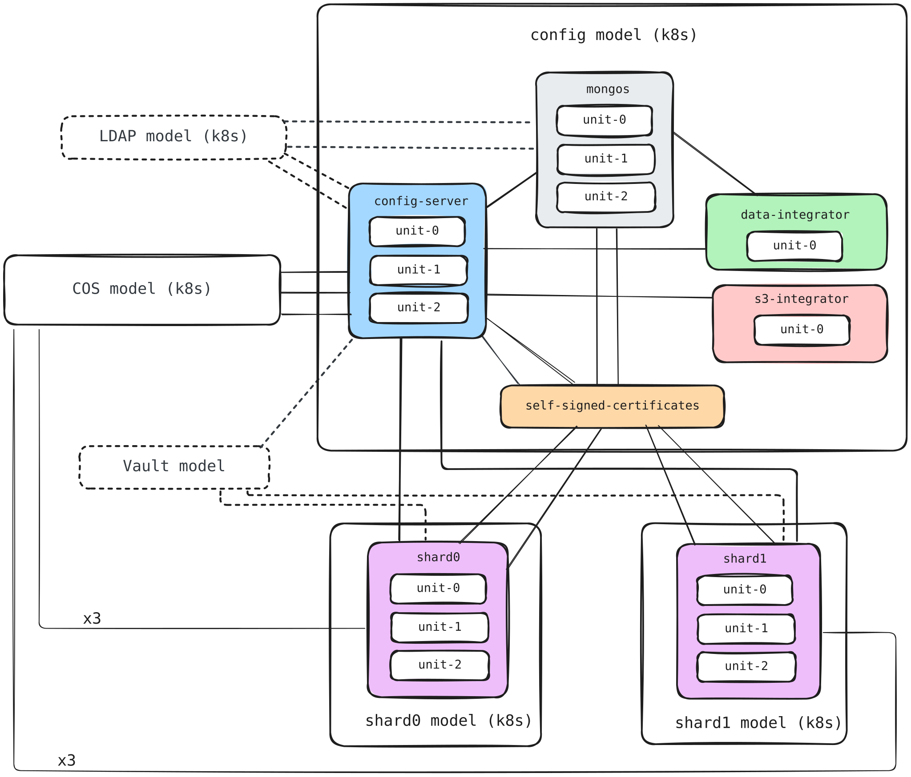

# Terraform module for MongoDB Sharded Cluster on Kubernetes

This Terraform root module facilitates the deployment of a Charmed MongoDB
sharded cluster on Kubernetes using the
[Terraform Juju provider](https://github.com/juju/terraform-provider-juju/).
For more information, refer to the provider
[documentation](https://registry.terraform.io/providers/juju/juju/latest/docs).

The solution deploys a MongoDB sharded cluster with config server, mongos, 
multiple shards, data integrator, TLS certificates, and COS Lite. It can
also integrate with existing LDAP and Vault deployments and an optional S3
integrator for backups.

The deployment uses a scalable number of Kubernetes models:

- The config-server model contains the config server, mongos, data integrator,
  optional S3 integrator, and self-signed-certificates for MongoDB TLS.
- Dynamic shard models: Each shard is deployed in its own model with either 
  custom names or auto-generated names (mongodb-shard-1, mongodb-shard-2, etc.)
- Cross-model certificate integration: The self-signed-certificates application
  in the config-server model provides TLS certificates to all shards via offers.

## Requirements

| Name          | Version      |
| ------------- | ------------ |
| Terraform     | >= 1.6       |
| Juju provider | ~> 2.0       |
| Juju          | 3.6 or later |

The Kubernetes cluster must already be registered as a Juju cloud. By
default, both the MongoDB and COS models use a cloud and credential named
`k8s`. Override `model_config` and `cos` when the registered names differ.

The Juju provider can be configured with `JUJU_CONTROLLER_ADDRESSES`,
`JUJU_USERNAME`, and `JUJU_PASSWORD`.

## Providers

| Name   | Version   |
| ------ | --------- |
| `juju` | ~> 2.0    |

## Modules

| Name                       | Source                                                                    |
| -------------------------- | ------------------------------------------------------------------------- |
| `mongodb_sharded_cluster`  | `canonical/mongodb-k8s-operator//terraform/product/sharded_cluster` (`8/edge`) |
| `cos`                      | `canonical/observability-stack//terraform/cos-lite` (`tf-cos-lite-3.0.2`) |
| `self_signed_certificates` | `canonical/self-signed-certificates-operator//terraform` (`main`)         |

## Resources

| Name                        | Type                                                                                                    |
| --------------------------- | ------------------------------------------------------------------------------------------------------- |
| `juju_model.config_server`  | [Juju model](https://registry.terraform.io/providers/juju/juju/latest/docs/resources/model)             |
| `juju_model.shards`         | [Juju model](https://registry.terraform.io/providers/juju/juju/latest/docs/resources/model)             |
| `juju_offer.certificates`   | [Juju offer](https://registry.terraform.io/providers/juju/juju/latest/docs/resources/offer)             |

Applications, integrations, offers, secrets, and COS resources are managed by
the child modules listed above.

## Inputs

| Name                                    | Description                                                                                                                                                                                       | Type                                                                                                                                                                                                                                                                                                                                                                                                                                                                                                                                                                                                                                                                                                                                                                                                       | Default                                                                          | Required   |
| --------------------------------------- | ------------------------------------------------------------------------------------------------------------------------------------------------------------------------------------------------- | ---------------------------------------------------------------------------------------------------------------------------------------------------------------------------------------------------------------------------------------------------------------------------------------------------------------------------------------------------------------------------------------------------------------------------------------------------------------------------------------------------------------------------------------------------------------------------------------------------------------------------------------------------------------------------------------------------------------------------------------------------------------------------------------------------------- | -------------------------------------------------------------------------------- | :--------: |
| `model_config`                          | Configuration for Kubernetes models                                                                                                                                                               | <pre>object({<br/>  cloud      = optional(string, "k8s")<br/>  credential = optional(string, "k8s")<br/>})</pre>                                                                                                                                                                                                                                                                                                                                                                                                                                                                                                                                                                                                                                                                                               | `{}`                                                                             | no         |
| `models`                                | Centralized model names for config-server and shards                                                                                                                                             | <pre>object({<br/>  config_server = optional(string, "mongodb-config")<br/>  shards        = optional(list(string), ["mongodb-shard-one", "mongodb-shard-two"])<br/>})</pre>                                                                                                                                                                                                                                                                                                                                                                                                                                                                                                                                                                                                                                   | `{}`                                                                             | no         |
| `cos`                                   | COS model, cloud, credential, and channel risk configuration                                                                                                                                      | <pre>object({<br/>  model_name                    = optional(string, "cos")<br/>  cloud                         = optional(string, "k8s")<br/>  credential                    = optional(string, "k8s")<br/>  risk                          = optional(string, "stable")<br/>  grafana_storage_directives    = optional(map(string), { database = "1G" })<br/>  loki_storage_directives       = optional(map(string), { active-index-directory = "1G", loki-chunks = "1G" })<br/>  prometheus_storage_directives = optional(map(string), { database = "1G" })<br/>})</pre>                                                          | `{}`                                                                             | no         |
| `config_server`                         | MongoDB config-server application configuration                                                                                                                                                   | <pre>object({<br/>  app_name           = optional(string, "config-server")<br/>  base               = optional(string, "ubuntu@24.04")<br/>  channel            = optional(string, "8/stable")<br/>  config             = optional(map(string), { role = "config-server" })<br/>  constraints        = optional(string, "arch=amd64")<br/>  endpoint_bindings  = optional(set(object({ space = string, endpoint = optional(string) })), [])<br/>  machines           = optional(set(string), null)<br/>  revision           = optional(number, null)<br/>  storage_directives = optional(map(string), {})<br/>  units              = optional(number, 1)<br/>})</pre>                                                             | `{}`                                                                             | no         |
| `mongos`                                | Mongos application configuration                                                                                                                                                                  | <pre>object({<br/>  app_name           = optional(string, "mongos")<br/>  base               = optional(string, "ubuntu@24.04")<br/>  channel            = optional(string, "8/stable")<br/>  config             = optional(map(string), {})<br/>  constraints        = optional(string, "arch=amd64")<br/>  endpoint_bindings  = optional(set(object({ space = string, endpoint = optional(string) })), [])<br/>  revision           = optional(number, null)<br/>  units              = optional(number, 1)<br/>})</pre>                                                                                                                                                                                                                                                                       | `{}`                                                                             | no         |
| `shards`                                | Shard application configurations (scalable list)                                                                                                                                                 | <pre>list(object({<br/>  app_name           = string<br/>  base               = optional(string, "ubuntu@24.04")<br/>  channel            = optional(string, "8/stable")<br/>  config             = optional(map(string), {})<br/>  constraints        = optional(string, "arch=amd64")<br/>  endpoint_bindings  = optional(set(object({ space = string, endpoint = optional(string) })), [])<br/>  machines           = optional(set(string), null)<br/>  revision           = optional(number, null)<br/>  storage_directives = optional(map(string), {})<br/>  units              = optional(number, 3)<br/>}))</pre>                                                                                                                                     | `[{ app_name = "shard-one" }, { app_name = "shard-two" }]`                      | no         |
| `data_integrator`                       | Data-integrator application configuration                                                                                                                                                         | <pre>object({<br/>  app_name           = optional(string, "data-integrator")<br/>  base               = optional(string, "ubuntu@24.04")<br/>  channel            = optional(string, "latest/stable")<br/>  config             = optional(map(string), { database-name = "mongodb", extra-user-roles = "admin" })<br/>  constraints        = optional(string, "arch=amd64")<br/>  endpoint_bindings  = optional(set(object({ space = string, endpoint = optional(string) })), [])<br/>  machines           = optional(set(string), null)<br/>  revision           = optional(number, null)<br/>  storage_directives = optional(map(string), {})<br/>  units              = optional(number, 1)<br/>})</pre>                                                                                                | `{}`                                                                             | no         |
| `s3_integrator`                         | Optional S3 backup-integrator configuration                                                                                                                                                       | <pre>object({<br/>  config      = map(string)<br/>  channel     = optional(string, "2/stable")<br/>  base        = optional(string, "ubuntu@24.04")<br/>  revision    = optional(number, null)<br/>  constraints = optional(string, "arch=amd64")<br/>  machines    = optional(set(string), [])<br/>})</pre>                                                                                                                                                                                                                                                                                                                                                                                                                                                                                               | `null`                                                                           | no         |
| `s3_access_key`                         | Optional S3 access key                                                                                                                                                                            | `string` (sensitive)                                                                                                                                                                                                                                                                                                                                                                                                                                                                                                                                                                                                                                                                                                                                                                                       | `null`                                                                           | no         |
| `s3_secret_key`                         | Optional S3 secret key                                                                                                                                                                            | `string` (sensitive)                                                                                                                                                                                                                                                                                                                                                                                                                                                                                                                                                                                                                                                                                                                                                                                       | `null`                                                                           | no         |
| `tls_client_private_key`                | Optional PEM private key for MongoDB client-to-server TLS                                                                                                                                         | `string` (sensitive)                                                                                                                                                                                                                                                                                                                                                                                                                                                                                                                                                                                                                                                                                                                                                                                       | `null`                                                                           | no         |
| `tls_peer_private_key`                  | Optional PEM private key for MongoDB peer-to-peer TLS                                                                                                                                             | `string` (sensitive)                                                                                                                                                                                                                                                                                                                                                                                                                                                                                                                                                                                                                                                                                                                                                                                       | `null`                                                                           | no         |
| `logging_config`                        | Logging configuration used by the MongoDB sharded-cluster module                                                                                                                                 | `string`                                                                                                                                                                                                                                                                                                                                                                                                                                                                                                                                                                                                                                                                                                                                                                                                   | `"<root>=INFO"`                                                                  | no         |
| `self_signed_certificates`              | Self-signed-certificates application configuration                                                                                                                                                | <pre>object({<br/>  app_name    = optional(string, "self-signed-certificates")<br/>  channel     = optional(string, "1/stable")<br/>  revision    = optional(number, null)<br/>  base        = optional(string, "ubuntu@24.04")<br/>  constraints = optional(string, "arch=amd64")<br/>  config      = optional(map(string), { ca-common-name = "MongoDB CA" })<br/>  units       = optional(number, 1)<br/>})</pre>                                                                                                                                                                                                                                                                                                                                                                                       | `{}`                                                                             | no         |
| `ldap_integration`                      | Optional existing LDAP offer; must be configured with `ldap_certificate_transfer_integration`                                                                                                    | `object({ url = string })`                                                                                                                                                                                                                                                                                                                                                                                                                                                                                                                                                                                                                                                                                                                                                                                 | `null`                                                                           | no         |
| `ldap_certificate_transfer_integration` | Optional existing LDAP certificate-transfer offer; must be configured with `ldap_integration`                                                                                                    | `object({ url = string })`                                                                                                                                                                                                                                                                                                                                                                                                                                                                                                                                                                                                                                                                                                                                                                                 | `null`                                                                           | no         |
| `vault_kv_integration`                  | Optional existing Vault KV offer for encryption at rest                                                                                                                                           | `object({ url = string })`                                                                                                                                                                                                                                                                                                                                                                                                                                                                                                                                                                                                                                                                                                                                                                                 | `null`                                                                           | no         |

## Outputs

| Name           | Description                                                              |
| -------------- | ------------------------------------------------------------------------ |
| `components`   | Map of all components deployed by the solution                           |
| `metadata`     | Metadata of the MongoDB sharded-cluster deployment                      |
| `models`       | Map keyed by model UUID containing the components deployed in each model |
| `offers`       | Map of offers exposed by the solution                                    |
| `shard_models` | Map of shard models created, keyed by shard index                       |

## Optional integrations

### LDAP

The module does not deploy LDAP. To integrate an LDAP deployment from another
model, provide both its `ldap` and `ldap-certificate-transfer` offer URLs:

```hcl
ldap_integration = {
  url = "admin/ldap.ldap"
}

ldap_certificate_transfer_integration = {
  url = "admin/ldap.send-ca-cert"
}
```

Both integrations must be configured together and must refer to an existing,
operational LDAP deployment.

### Encryption at rest

Enable encryption in the MongoDB configuration and provide the Vault KV offer:

```hcl
config_server = {
  config = {
    role                      = "config-server"
    enable-encryption-at-rest = "true"
  }
}

vault_kv_integration = {
  url = "admin/vault.vault-kv"
}
```

The module does not initialize, unseal, authorize, or configure Vault.

The offer must refer to an existing operational Vault deployment.
Follow the
[`vault` charm documentation](https://charmhub.io/vault/docs/h-initialize-vault)
to prepare it before applying this module.

### S3 backups

The S3 bucket must exist before deploying this solution. The AWS identity used
by the backup integrator must be able to list the bucket and read, create, and
delete objects under the configured path.

Add the backup integrator configuration to `terraform.tfvars`:

```hcl
s3_integrator = {
  config = {
    bucket   = "my-mongodb-backups"
    region   = "eu-west-3"
    endpoint = "https://s3.eu-west-3.amazonaws.com"
    path     = "mongodb"
  }
}
```

The configuration fields are:

- `bucket`: name of the existing S3 bucket.
- `region`: AWS region containing the bucket.
- `endpoint`: S3 API endpoint for the selected region.
- `path`: optional prefix under which MongoDB backups are stored.

Provide the S3 credentials through sensitive Terraform environment variables
instead of writing them to `terraform.tfvars`:

```bash
export TF_VAR_s3_access_key="<s3-access-key>"
export TF_VAR_s3_secret_key="<s3-secret-key>"
```

### TLS certificates

The solution deploys `self-signed-certificates` as its default certificate
authority. This is intended for evaluation, use your organization's certificate
provider for production deployments.

Optional custom MongoDB client and peer TLS private keys can be supplied through
the sensitive `tls_client_private_key` and `tls_peer_private_key` variables.

## Deploy

The following diagram shows the components deployed by this solution and their
integrations across the Kubernetes models.



If the Kubernetes cloud is not registered in Juju as `k8s`, configure its
registered cloud and credential names:

```hcl
model_config = {
  cloud      = "my-k8s"
  credential = "my-k8s"
}

cos = {
  cloud      = "my-k8s"
  credential = "my-k8s"
}
```

The default COS storage directives explicitly allocate 1 GiB to Grafana and
Prometheus, and 1 GiB to each of Loki's two volumes. These small defaults are
intended only for local testing. Size every volume for the expected retention
and ingestion volume before production deployment:

```hcl
cos = {
  grafana_storage_directives = {
    database = "20G"
  }
  loki_storage_directives = {
    active-index-directory = "20G"
    loki-chunks             = "100G"
  }
  prometheus_storage_directives = {
    database = "100G"
  }
}
```

Initialize Terraform:

```bash
terraform init
```

Plan and apply the solution:

```bash
terraform plan \
  -out terraform.out
terraform apply terraform.out
```

## Advanced Configuration

### Model and Shard Configuration

This deployment supports scalable shards through dynamic model creation. All Juju model names are centrally configured in a `models` variable and matched by index to shard configurations.

#### Default Configuration (2 Shards)
```hcl
models = {
  config_server = "mongodb-config"
  shards = ["mongodb-shard-one", "mongodb-shard-two"]
}

shards = [
  { app_name = "shard-one" },    # → deployed in "mongodb-shard-one"
  { app_name = "shard-two" },    # → deployed in "mongodb-shard-two"
]
```

#### Custom Multi-Shard Configuration
```hcl
models = {
  config_server = "production-config"
  shards = [
    "primary-shard-model",
    "analytics-shard-model", 
    "cache-shard-model",
    "archive-shard-model"
  ]
}

shards = [
  {
    app_name    = "primary-shard"
    units       = 5
    constraints = "arch=amd64 cores=4 mem=8G"
  },
  {
    app_name    = "analytics-shard"
    units       = 3
    constraints = "arch=amd64 cores=2 mem=4G"
  },
  {
    app_name    = "cache-shard"
    units       = 3
    constraints = "arch=amd64 cores=2 mem=4G"
  },
  {
    app_name    = "archive-shard"
    units       = 1
    constraints = "arch=amd64 cores=1 mem=2G"
  }
]
```

#### Configuration Rules
- **Index matching**: `shards[i]` is deployed in `models.shards[i]`
- **Count validation**: Number of shard models must equal number of shards
- **Unique names**: All model names (config + shards) must be unique
- **Flexible naming**: Use any naming convention that fits your environment

### Observability Stack (COS)

The solution automatically deploys COS Lite for monitoring, logging, and alerting capabilities.
MongoDB observability is provided through direct integrations with COS components.

**COS Storage Configuration:**
The default storage directives are intended only for testing. Size every volume
for expected retention and ingestion volume before production deployment:

```hcl
cos = {
  grafana_storage_directives = {
    database = "20G"
  }
  loki_storage_directives = {
    active-index-directory = "20G"
    loki-chunks             = "100G"
  }
  prometheus_storage_directives = {
    database = "100G"
  }
}
```
