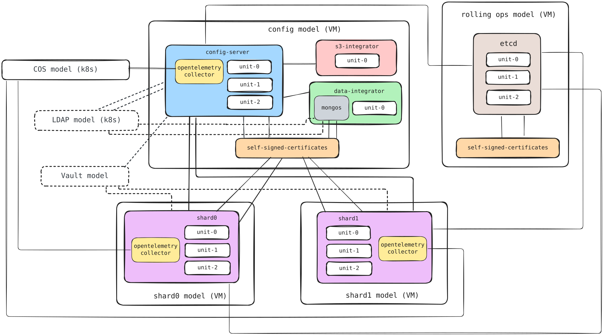

# Terraform module for MongoDB Sharded Cluster

This Terraform root module facilitates the deployment of a Charmed MongoDB
sharded cluster on AWS VMs using the
[Terraform Juju provider](https://github.com/juju/terraform-provider-juju/).
For more information, refer to the provider
[documentation](https://registry.terraform.io/providers/juju/juju/latest/docs).

The solution deploys a MongoDB sharded cluster with config server, mongos,
multiple shards, data integrator, etcd for rolling operations, TLS certificates,
OpenTelemetry Collector, and COS Lite. It can also integrate with existing LDAP
and Vault deployments and an optional S3 integrator for backups.

The deployment uses a scalable number of AWS models:

- The config-server model contains the config server, mongos, data integrator,
  optional S3 integrator, and self-signed-certificates for MongoDB TLS.
- Each shard is deployed in its own model, named through `models.shards`.
  The defaults are `mongodb-shard-one` and `mongodb-shard-two`.
- The mongodb-etcd model (hardcoded name) contains charmed etcd with its own
  self-signed-certificates for rolling operations.

## Requirements

| Name          | Version      |
| ------------- | ------------ |
| Terraform     | >= 1.6       |
| Juju provider | ~> 2.0       |
| Juju          | 3.6 or later |

An AWS cloud and credential must be configured in Juju. A Kubernetes cloud and
credential named `k8s` are used for COS Lite by default and can be overridden
through `var.cos`.

The Juju provider can be configured with `JUJU_CONTROLLER_ADDRESSES`,
`JUJU_USERNAME`, and `JUJU_PASSWORD`.

## Providers

| Name   | Version   |
| ------ | --------- |
| `juju` | ~> 2.0    |

## Modules

| Name                       | Source                                                                     |
| -------------------------- | -------------------------------------------------------------------------- |
| `mongodb_sharded_cluster`  | `canonical/mongodb-operator//terraform/product/sharded_cluster` (`8/edge`) |
| `charmed_etcd`             | `canonical/charmed-etcd-operator//terraform/charm` (`3.6/edge`)            |
| `cos`                      | `canonical/observability-stack//terraform/cos-lite` (`tf-cos-lite-3.0.2`)  |
| `self_signed_certificates` | `canonical/self-signed-certificates-operator//terraform` (`main`)          |

## Resources

| Name                                                         | Type                                                                                                    |
| ------------------------------------------------------------ | ------------------------------------------------------------------------------------------------------- |
| `juju_model.config_server`                                   | [Juju model](https://registry.terraform.io/providers/juju/juju/latest/docs/resources/model)             |
| `juju_model.shards`                                          | [Juju model](https://registry.terraform.io/providers/juju/juju/latest/docs/resources/model)             |
| `juju_model.etcd`                                            | [Juju model](https://registry.terraform.io/providers/juju/juju/latest/docs/resources/model)             |
| `juju_space.peers`                                           | [Juju space](https://registry.terraform.io/providers/juju/juju/latest/docs/resources/space)             |
| `juju_subnet.peers`                                          | [Juju subnet](https://registry.terraform.io/providers/juju/juju/latest/docs/resources/subnet)           |
| `juju_offer.etcd`                                            | [Juju offer](https://registry.terraform.io/providers/juju/juju/latest/docs/resources/offer)             |
| `juju_offer.certificates`                                    | [Juju offer](https://registry.terraform.io/providers/juju/juju/latest/docs/resources/offer)             |
| `juju_application.opentelemetry_collector_config`            | [Juju application](https://registry.terraform.io/providers/juju/juju/latest/docs/resources/application) |
| `juju_application.opentelemetry_collector_shards`            | [Juju application](https://registry.terraform.io/providers/juju/juju/latest/docs/resources/application) |
| `juju_integration.opentelemetry_collector_config_prometheus` | [Juju integration](https://registry.terraform.io/providers/juju/juju/latest/docs/resources/integration) |
| `juju_integration.opentelemetry_collector_config_loki`       | [Juju integration](https://registry.terraform.io/providers/juju/juju/latest/docs/resources/integration) |
| `juju_integration.opentelemetry_collector_config_dashboards` | [Juju integration](https://registry.terraform.io/providers/juju/juju/latest/docs/resources/integration) |
| `juju_integration.opentelemetry_collector_shards_prometheus` | [Juju integration](https://registry.terraform.io/providers/juju/juju/latest/docs/resources/integration) |
| `juju_integration.opentelemetry_collector_shards_loki`       | [Juju integration](https://registry.terraform.io/providers/juju/juju/latest/docs/resources/integration) |
| `juju_integration.opentelemetry_collector_shards_dashboards` | [Juju integration](https://registry.terraform.io/providers/juju/juju/latest/docs/resources/integration) |

## Inputs

| Name                                    | Description                                                                                                                                                                                                                                                                                                                                                                                             | Type                                                                                                                                                                                                                                                                                                                                                                                                                                                                                                                                                                                                                                                                                                                                                                                                                                                                                                                                                                                                                                                                                                                                                                       | Default                                                       | Required |
| --------------------------------------- | ------------------------------------------------------------------------------------------------------------------------------------------------------------------------------------------------------------------------------------------------------------------------------------------------------------------------------------------------------------------------------------------------------- | -------------------------------------------------------------------------------------------------------------------------------------------------------------------------------------------------------------------------------------------------------------------------------------------------------------------------------------------------------------------------------------------------------------------------------------------------------------------------------------------------------------------------------------------------------------------------------------------------------------------------------------------------------------------------------------------------------------------------------------------------------------------------------------------------------------------------------------------------------------------------------------------------------------------------------------------------------------------------------------------------------------------------------------------------------------------------------------------------------------------------------------------------------------------------- | ------------------------------------------------------------- | :------: |
| `model_config`                          | Configuration for Juju models.                                                                                                                                                                                                                                                                                                                                                                          | <pre>object({<br/>  cloud      = optional(string, "aws")<br/>  credential = optional(string, null)<br/>})</pre>                                                                                                                                                                                                                                                                                                                                                                                                                                                                                                                                                                                                                                                                                                                                                                                                                                                                                                                                                                                                                                                            | `{}`                                                          | no       |
| `models`                                | Names of the AWS models used for the MongoDB deployment. The number of shard models must match the number of shards configured.                                                                                                                                                                                                                                                                         | <pre>object({<br/>  config_server = optional(string, "mongodb-config")<br/>  shards        = optional(list(string), ["mongodb-shard-one", "mongodb-shard-two"])<br/>})</pre>                                                                                                                                                                                                                                                                                                                                                                                                                                                                                                                                                                                                                                                                                                                                                                                                                                                                                                                                                                                               | `{}`                                                          | no       |
| `vpc_id`                                | Optional AWS VPC ID shared by the solution infrastructure. Juju applies it to the cluster models. This setting is immutable after model creation. Required if you use the `clouds/aws` module in this repository to configure the AWS cloud, since that module creates the Juju controller in a specific VPC. Leave unset if you manage your own AWS cloud configuration and Juju controller placement. | `string`                                                                                                                                                                                                                                                                                                                                                                                                                                                                                                                                                                                                                                                                                                                                                                                                                                                                                                                                                                                                                                                                                                                                                                   | `null`                                                        | no       |
| `network_spaces`                        | CIDR of the existing AWS subnet assigned to the peers Juju space in the config-server model and every shard model.                                                                                                                                                                                                                                                                                      | <pre>object({<br/>  peers_cidr = optional(string, "10.3.0.0/24")<br/>})</pre>                                                                                                                                                                                                                                                                                                                                                                                                                                                                                                                                                                                                                                                                                                                                                                                                                                                                                                                                                                                                                                                                                              | `{}`                                                          | no       |
| `cos`                                   | Configuration for the Charmed Observability Stack. Storage defaults are intended for testing and must be sized before production deployment.                                                                                                                                                                                                                                                            | <pre>object({<br/>  model_name                    = optional(string, "cos")<br/>  cloud                         = optional(string, "k8s")<br/>  credential                    = optional(string, "k8s")<br/>  risk                          = optional(string, "stable")<br/>  grafana_storage_directives    = optional(map(string), { database = "1G" })<br/>  loki_storage_directives       = optional(map(string), { active-index-directory = "1G", loki-chunks = "1G" })<br/>  prometheus_storage_directives = optional(map(string), { database = "1G" })<br/>})</pre>                                                                                                                                                                                                                                                                                                                                                                                                                                                                                                                                                                                                 | `{}`                                                          | no       |
| `config_server`                         | MongoDB config-server application configuration.                                                                                                                                                                                                                                                                                                                                                        | <pre>object({<br/>  app_name    = optional(string, "config-server")<br/>  base        = optional(string, "ubuntu@24.04")<br/>  channel     = optional(string, "8/stable")<br/>  config      = optional(map(string), { role = "config-server" })<br/>  constraints = optional(string, "arch=amd64 spaces=peers")<br/>  endpoint_bindings = optional(set(object({<br/>    space    = string<br/>    endpoint = optional(string)<br/>    })), [<br/>    {<br/>      endpoint = "database-peers"<br/>      space    = "peers"<br/>    },<br/>    {<br/>      endpoint = "config-server"<br/>      space    = "peers"<br/>    },<br/>    {<br/>      endpoint = "cluster"<br/>      space    = "peers"<br/>    },<br/>  ])<br/>  expose = optional(list(object({<br/>    cidrs     = optional(string)<br/>    endpoints = optional(string)<br/>    spaces    = optional(string)<br/>    })), [<br/>    {<br/>      spaces = "peers"<br/>    },<br/>  ])<br/>  machines           = optional(set(string), [])<br/>  revision           = optional(number, null)<br/>  storage_directives = optional(map(string), {})<br/>  units              = optional(number, 3)<br/>})</pre> | `{}`                                                          | no       |
| `mongos`                                | Mongos application configuration.                                                                                                                                                                                                                                                                                                                                                                       | <pre>object({<br/>  app_name = optional(string, "mongos")<br/>  base     = optional(string, "ubuntu@24.04")<br/>  channel  = optional(string, "8/stable")<br/>  config   = optional(map(string), {})<br/>  endpoint_bindings = optional(set(object({<br/>    space    = string<br/>    endpoint = optional(string)<br/>    })), [<br/>    {<br/>      endpoint = "router-peers"<br/>      space    = "peers"<br/>    },<br/>    {<br/>      endpoint = "cluster"<br/>      space    = "peers"<br/>    },<br/>  ])<br/>  revision = optional(number, null)<br/>})</pre>                                                                                                                                                                                                                                                                                                                                                                                                                                                                                                                                                                                                     | `{}`                                                          | no       |
| `shards`                                | Configuration for MongoDB shards. Each shard will be deployed in the corresponding model from models.shards (matched by index).                                                                                                                                                                                                                                                                         | <pre>list(object({<br/>  app_name    = string<br/>  base        = optional(string, "ubuntu@24.04")<br/>  channel     = optional(string, "8/stable")<br/>  config      = optional(map(string), { role = "shard" })<br/>  constraints = optional(string, "arch=amd64 spaces=peers")<br/>  endpoint_bindings = optional(set(object({<br/>    space    = string<br/>    endpoint = optional(string)<br/>    })), [<br/>    {<br/>      endpoint = "database-peers"<br/>      space    = "peers"<br/>    },<br/>    {<br/>      endpoint = "sharding"<br/>      space    = "peers"<br/>    },<br/>  ])<br/>  expose = optional(list(object({<br/>    cidrs     = optional(string)<br/>    endpoints = optional(string)<br/>    spaces    = optional(string)<br/>    })), [<br/>    {<br/>      spaces = "peers"<br/>    },<br/>  ])<br/>  machines           = optional(set(string), [])<br/>  revision           = optional(number, null)<br/>  storage_directives = optional(map(string), {})<br/>  units              = optional(number, 3)<br/>}))</pre>                                                                                                                    | `[ { app_name = "shard-one" }, { app_name = "shard-two" }, ]` | no       |
| `data_integrator`                       | Data-integrator configuration. It is deployed in the config-server model.                                                                                                                                                                                                                                                                                                                               | <pre>object({<br/>  app_name    = optional(string, "data-integrator")<br/>  base        = optional(string, "ubuntu@24.04")<br/>  channel     = optional(string, "latest/stable")<br/>  config      = optional(map(string), { database-name = "mongodb", extra-user-roles = "admin" })<br/>  constraints = optional(string, "arch=amd64 spaces=peers")<br/>  endpoint_bindings = optional(set(object({<br/>    space    = string<br/>    endpoint = optional(string)<br/>    })), [<br/>    {<br/>      endpoint = "mongos"<br/>      space    = "peers"<br/>    },<br/>  ])<br/>  machines           = optional(set(string), [])<br/>  revision           = optional(number, null)<br/>  storage_directives = optional(map(string), {})<br/>  units              = optional(number, 1)<br/>})</pre>                                                                                                                                                                                                                                                                                                                                                                        | `{}`                                                          | no       |
| `s3_integrator`                         | Optional S3 backup integrator configuration.                                                                                                                                                                                                                                                                                                                                                            | <pre>object({<br/>  base        = optional(string, "ubuntu@24.04")<br/>  channel     = optional(string, "2/stable")<br/>  config      = map(string)<br/>  constraints = optional(string, "arch=amd64")<br/>  machines    = optional(set(string), [])<br/>  revision    = optional(number, null)<br/>})</pre>                                                                                                                                                                                                                                                                                                                                                                                                                                                                                                                                                                                                                                                                                                                                                                                                                                                               | `null`                                                        | no       |
| `etcd`                                  | Charmed etcd configuration. It is deployed in a hardcoded 'mongodb-etcd' model using the etcd charm module.                                                                                                                                                                                                                                                                                             | <pre>object({<br/>  app_name          = optional(string, "etcd")<br/>  channel           = optional(string, "3.6/stable")<br/>  revision          = optional(number, null)<br/>  base              = optional(string, "ubuntu@24.04")<br/>  constraints       = optional(string, "arch=amd64")<br/>  config            = optional(map(string), {})<br/>  storage           = optional(map(string), {})<br/>  units             = optional(number, 3)<br/>  machines          = optional(set(string), null)<br/>  endpoint_bindings = optional(map(string), {})<br/>  expose            = optional(bool, false)<br/>})</pre>                                                                                                                                                                                                                                                                                                                                                                                                                                                                                                                                                | `{}`                                                          | no       |
| `self_signed_certificates`              | Self-signed-certificates application configuration for MongoDB TLS.                                                                                                                                                                                                                                                                                                                                     | <pre>object({<br/>  app_name    = optional(string, "self-signed-certificates")<br/>  base        = optional(string, "ubuntu@24.04")<br/>  channel     = optional(string, "1/stable")<br/>  config      = optional(map(string), { ca-common-name = "MongoDB CA" })<br/>  constraints = optional(string, "arch=amd64")<br/>  revision    = optional(number, null)<br/>  units       = optional(number, 1)<br/>})</pre>                                                                                                                                                                                                                                                                                                                                                                                                                                                                                                                                                                                                                                                                                                                                                       | `{}`                                                          | no       |
| `opentelemetry_collector`               | OpenTelemetry Collector configuration for observability integration.                                                                                                                                                                                                                                                                                                                                    | <pre>object({<br/>  app_name = optional(string, "opentelemetry-collector")<br/>  base     = optional(string, "ubuntu@24.04")<br/>  channel  = optional(string, "2/stable")<br/>  config   = optional(map(string), {})<br/>  revision = optional(number, null)<br/>})</pre>                                                                                                                                                                                                                                                                                                                                                                                                                                                                                                                                                                                                                                                                                                                                                                                                                                                                                                 | `{}`                                                          | no       |
| `ldap_integration`                      | Optional existing LDAP offer. Must be configured together with ldap_certificate_transfer_integration.                                                                                                                                                                                                                                                                                                   | <pre>object({<br/>  url = string<br/>})</pre>                                                                                                                                                                                                                                                                                                                                                                                                                                                                                                                                                                                                                                                                                                                                                                                                                                                                                                                                                                                                                                                                                                                              | `null`                                                        | no       |
| `ldap_certificate_transfer_integration` | Optional existing LDAP certificate transfer offer. Must be configured together with ldap_integration.                                                                                                                                                                                                                                                                                                   | <pre>object({<br/>  url = string<br/>})</pre>                                                                                                                                                                                                                                                                                                                                                                                                                                                                                                                                                                                                                                                                                                                                                                                                                                                                                                                                                                                                                                                                                                                              | `null`                                                        | no       |
| `vault_kv_integration`                  | Optional existing Vault KV offer for MongoDB encryption at rest.                                                                                                                                                                                                                                                                                                                                        | <pre>object({<br/>  url = string<br/>})</pre>                                                                                                                                                                                                                                                                                                                                                                                                                                                                                                                                                                                                                                                                                                                                                                                                                                                                                                                                                                                                                                                                                                                              | `null`                                                        | no       |
| `s3_access_key`                         | Optional S3 access key.                                                                                                                                                                                                                                                                                                                                                                                 | `string` (sensitive)                                                                                                                                                                                                                                                                                                                                                                                                                                                                                                                                                                                                                                                                                                                                                                                                                                                                                                                                                                                                                                                                                                                                                       | `null`                                                        | no       |
| `s3_secret_key`                         | Optional S3 secret key.                                                                                                                                                                                                                                                                                                                                                                                 | `string` (sensitive)                                                                                                                                                                                                                                                                                                                                                                                                                                                                                                                                                                                                                                                                                                                                                                                                                                                                                                                                                                                                                                                                                                                                                       | `null`                                                        | no       |
| `tls_client_private_key`                | Optional PEM private key for config-server client TLS.                                                                                                                                                                                                                                                                                                                                                  | `string` (sensitive)                                                                                                                                                                                                                                                                                                                                                                                                                                                                                                                                                                                                                                                                                                                                                                                                                                                                                                                                                                                                                                                                                                                                                       | `null`                                                        | no       |
| `tls_peer_private_key`                  | Optional PEM private key for config-server peer TLS.                                                                                                                                                                                                                                                                                                                                                    | `string` (sensitive)                                                                                                                                                                                                                                                                                                                                                                                                                                                                                                                                                                                                                                                                                                                                                                                                                                                                                                                                                                                                                                                                                                                                                       | `null`                                                        | no       |
| `logging_config`                        | Logging configuration used by the MongoDB sharded-cluster module.                                                                                                                                                                                                                                                                                                                                       | `string`                                                                                                                                                                                                                                                                                                                                                                                                                                                                                                                                                                                                                                                                                                                                                                                                                                                                                                                                                                                                                                                                                                                                                                   | `"<root>=INFO"`                                               | no       |

## Outputs

| Name           | Description                                                              |
| -------------- | ------------------------------------------------------------------------ |
| `components`   | Map of all components deployed by the solution                           |
| `metadata`     | Metadata of the MongoDB sharded-cluster deployment                       |
| `models`       | Map keyed by model UUID containing the components deployed in each model |
| `offers`       | Map of offers exposed by the solution                                    |
| `shard_models` | Map of shard models created, keyed by shard index                        |

## Optional integrations

### LDAP

The module does not deploy LDAP. To integrate an LDAP deployment from another
model, provide both its `ldap` and `ldap-certificate-transfer` offer URLs:

```hcl
ldap_integration = {
  url = "admin/ldap.ldap"
}

ldap_certificate_transfer_integration = {
  url = "admin/ldap.send-ca-cert"
}
```

Both integrations must be configured together and must refer to an existing,
operational LDAP deployment.

### Encryption at rest

Enable encryption in the MongoDB configuration and provide the Vault KV offer:

```hcl
config_server = {
  config = {
    role                      = "config-server"
    enable-encryption-at-rest = "true"
  }
}

vault_kv_integration = {
  url = "admin/vault.vault-kv"
}
```

The module does not initialize, unseal, authorize, or configure Vault.

The offer must refer to an existing operational Vault deployment.
Follow the
[`vault` charm documentation](https://charmhub.io/vault/docs/h-initialize-vault)
to prepare it before applying this module.

### S3 backups

The S3 bucket must exist before deploying this solution. The AWS identity used
by the backup integrator must be able to list the bucket and read, create, and
delete objects under the configured path.

Add the backup integrator configuration to `terraform.tfvars`:

```hcl
s3_integrator = {
  config = {
    bucket   = "my-mongodb-backups"
    region   = "eu-west-3"
    endpoint = "https://s3.eu-west-3.amazonaws.com"
    path     = "mongodb"
  }
}
```

The configuration fields are:

- `bucket`: name of the existing S3 bucket.
- `region`: AWS region containing the bucket.
- `endpoint`: S3 API endpoint for the selected region.
- `path`: optional prefix under which MongoDB backups are stored.

Provide the S3 credentials through sensitive Terraform environment variables
instead of writing them to `terraform.tfvars`:

```bash
export TF_VAR_s3_access_key="<s3-access-key>"
export TF_VAR_s3_secret_key="<s3-secret-key>"
```

### TLS certificates

The solution deploys `self-signed-certificates` as its default certificate
authority. This is intended for evaluation, use your organization's certificate
provider for production deployments.

Optional custom MongoDB client and peer TLS private keys can be supplied through
the sensitive `tls_client_private_key` and `tls_peer_private_key` variables.

## Deploy

The following diagram shows the components deployed by this solution and their
integrations across the AWS VM and Kubernetes models.



Initialize Terraform:

```bash
terraform init
```

Retrieve the controller's VPC ID and expose it to Terraform:

```bash
export TF_VAR_vpc_id="$(juju model-config -m aws:controller vpc-id)"
```

Replace `aws` with your controller name if it differs.

Deploy the solution:

```bash
terraform plan \
  -var="vpc_id=${TF_VAR_vpc_id}" \
  -out terraform.out
terraform apply terraform.out
```

## Advanced Configuration

### Model and Shard Configuration

This deployment supports scalable shards through dynamic model creation. All Juju model names are centrally configured in a `models` variable and matched by index to shard configurations.

#### Default Configuration (2 Shards)
```hcl
models = {
  config_server = "mongodb-config"
  shards = ["mongodb-shard-one", "mongodb-shard-two"]
}

shards = [
  { app_name = "shard-one" },    # → deployed in "mongodb-shard-one"
  { app_name = "shard-two" },    # → deployed in "mongodb-shard-two"
]
```

#### Custom Multi-Shard Configuration
```hcl
models = {
  config_server = "production-config"
  shards = [
    "primary-shard-model",
    "analytics-shard-model",
    "cache-shard-model",
    "archive-shard-model"
  ]
}

shards = [
  {
    app_name    = "primary-shard"
    units       = 5
    constraints = "arch=amd64 spaces=peers cores=4 mem=8G"
  },
  {
    app_name    = "analytics-shard"
    units       = 3
    constraints = "arch=amd64 spaces=peers cores=2 mem=4G"
  },
  {
    app_name    = "cache-shard"
    units       = 3
    constraints = "arch=amd64 spaces=peers cores=2 mem=4G"
  },
  {
    app_name    = "archive-shard"
    units       = 1
    constraints = "arch=amd64 spaces=peers cores=1 mem=2G"
  }
]
```

#### Configuration Rules
- **Index matching**: `shards[i]` is deployed in `models.shards[i]`
- **Count validation**: Number of shard models must equal number of shards
- **Unique names**: All model names (config + shards) must be unique
- **Flexible naming**: Use any naming convention that fits your environment

### Network spaces

The solution creates a model-local `peers` Juju space in the config-server
model and every shard model. Each space is associated with the same existing
AWS subnet, whose CIDR defaults to `10.3.0.0/24`.

Config-server, shard, and data-integrator units use `spaces=peers` placement
constraints by default. Mongos is a subordinate of the data integrator and
runs on its machines. The following endpoints are explicitly bound to `peers`:

| Application     | Endpoints                                    |
| --------------- | -------------------------------------------- |
| Config server   | `database-peers`, `config-server`, `cluster` |
| Shards          | `database-peers`, `sharding`                 |
| Mongos          | `router-peers`, `cluster`                    |
| Data integrator | `mongos`                                     |

### Observability Stack (COS)

The solution automatically deploys COS Lite for monitoring, logging, and alerting capabilities.
MongoDB observability is provided through OpenTelemetry Collectors that are **always deployed**
and automatically configured in every model.

**OpenTelemetry Collector Configuration:**
```hcl
opentelemetry_collector = {
  app_name = "opentelemetry-collector"
  channel  = "2/stable"
  config   = {}
}
```

**COS Storage Configuration:**
The default storage directives are intended only for testing. Size every volume
for expected retention and ingestion volume before production deployment:

```hcl
cos = {
  grafana_storage_directives = {
    database = "20G"
  }
  loki_storage_directives = {
    active-index-directory = "20G"
    loki-chunks             = "100G"
  }
  prometheus_storage_directives = {
    database = "100G"
  }
}
```

### Rolling Operations and etcd Configuration

This deployment includes Charmed etcd for rolling operations support, enabling zero-downtime maintenance and coordinated rolling restarts across shards. The etcd deployment runs in the "mongodb-etcd" model with automatic TLS and integrates with all MongoDB components via cross-model offers.

The etcd cluster is automatically configured with minimal setup:

```hcl
etcd = {
  app_name    = "etcd"
  channel     = "3.6/stable"
  units       = 3  # Use odd numbers (3, 5, 7) for high availability
  constraints = "arch=amd64 cores=2 mem=4G"
  storage = {
    data = "10G"  # Adjust based on expected cluster size and retention
  }
}
```

The etcd TLS certificates are automatically managed by the product module with hardcoded settings:
- Channel: `1/stable`
- CA Common Name: `Etcd CA`
- No additional configuration required

For production deployments, consider:
- Using at least 3 etcd units for high availability
- Sizing storage based on cluster size and retention requirements
- Placing etcd units across different availability zones
